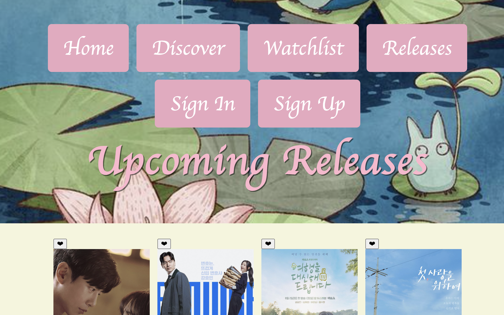

# DramaScope

DramaScope is a responsive, client-side web application for discovering, filtering, and tracking Asian dramas. It uses static HTML, CSS, and JavaScript so it can be served from a simple web server or GitHub Pages.

## Features
- **Dynamic search and filtering** – real-time filtering by title, genres, and narrative tropes using client-side JavaScript and an external JSON data source.
- **Multi-select genre & trope panels** – accessible `<details>` panels let users choose multiple genres or tropes with AND logic.
- **Touch-friendly carousel** – a single-row, horizontally scrollable featured carousel with CSS scroll-snap; hover or tap a poster to reveal its release year.
- **Persistent watchlist** – add or remove dramas from a personal list stored in `localStorage`.
- **Responsive design** – layouts built with CSS Grid and Flexbox work across mobile, tablet, and desktop screens.

## Screenshots

*Home page*


*Discover page*


*Upcoming releases*


*Watchlist management*


*Drama details*


*Login form*

## Page Guide
- **`index.html`** – landing page with a touch-friendly carousel of featured dramas.
- **`drama.html`** – search and filter catalogue by title, genre, or trope.
- **`details.html`** – view ratings, synopsis, and other metadata for a selected drama.
- **`watchlist.html`** – shows items saved in `localStorage` and lets users remove them.
- **`release.html`** – countdown list of upcoming dramas.
- **`auth/login.html` & `auth/signup.html`** – Supabase-powered authentication pages.
- **`account.html`** – displays user profile information and a sign‑out option.

Scripts powering these pages live under `docs/js/` (e.g. `watchlist.js`, `supabase-client.js`).

## Supabase Configuration
1. [Create a Supabase project](https://supabase.com/).
2. Copy the project URL and anon key.
3. Replace the placeholders in `docs/js/supabase-client.js`:
   ```js
   export const sb = window.supabase.createClient(
     'https://YOUR-PROJECT.supabase.co',
     'YOUR-ANON-KEY'
   );
   ```
4. Ensure your project's `SITE_URL` matches the deployed site root so email confirmations resolve correctly.
5. Create `profiles` and `watchlist` tables as described in the HTML comments of the auth pages.

## Watchlist Behaviour
Clicking **Add to Watchlist** on a drama card stores its data in `localStorage` under `dramascope_watchlist`. Visiting `watchlist.html` renders saved items and allows removal via the **Remove** button.

## Local Development
```bash
# Clone and enter the repository
 git clone https://github.com/your-username/DramaScope.git
 cd DramaScope/docs

# Serve the site locally
 python3 -m http.server 8000
```
Open <http://localhost:8000/index.html> in your browser.

## Deployment
Deploy the `docs/` directory to GitHub Pages. Ensure `index.html`, `drama.html`, `watchlist.html`, `release.html`, `asset.json`, `images/`, and `js/` are all inside `docs/`.

## External Resources
- [Google Fonts](https://fonts.google.com/) – Roboto, Rubik Moonrocks, and Lemon.
- [Supabase JavaScript Client](https://cdn.jsdelivr.net/npm/@supabase/supabase-js) loaded via CDN.

## Contributing
Documentation fixes and code improvements are welcome.
1. Fork the repository.
2. Create a feature branch.
3. Commit your changes and open a Pull Request against `main`.
4. Include relevant screenshots when updating documentation.

---
This project is released under the [MIT License](LICENSE).